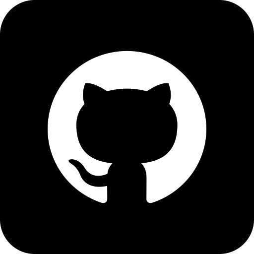

    
    

        

            <strong>Martin Dreyer</strong> 
            Udvikler og journalist 
            Odense, Danmark 
            
                📞 <a href="tel:+4542429697">Ring til mig</a>
            
            
                📧 <a href="mailto:martinchristiandreyer@gmail.com">Skriv en mail</a>
            
        

        

            
            
        

    

## Profil

Jeg er en journalistuddannet udvikler, der er glad for store datasæt og programmering, der understøtter god journalistik.  
Jeg bor i Odense med min kæreste, kan lide at læse og er semi-passioneret basketball-fan.

---

## Arbejde

### Udvikler og journalist  
**TV 2 FYN | 2019 - nu**

- Primær udvikler på et komplet redesign af tv2fyn.dk samt implementering af Statamic CMS  
- Udviklede transskriberingsværktøjet TTEX (Postgres, OAuth 2.0, notifikationssystem)  
- Datavisualisering og scraping i journalistisk sammenhæng  
- Tidligere jourhavende på den digitale redaktion

### Udvikler  
**TV 2 FYN | 2017 - 2018**

- Udviklede 11 undersider til TV 2 Fyn i forbindelse med kommunalvalget  
- Central del af datahåndtering i forbindelse med KV17  
- Udarbejdede datavisualiseringer på valgaftenen

### Kommunikationsmedarbejder  
**Middelfart Kommune | 2017 - 2019**

- Rådgav folkeskolerne i Middelfart Kommune om kommunikation  
- Fremstillede kommunikationsmateriale

---

## Uddannelse

**Kandidat, Amerikanske Studier**  
Syddansk Universitet, 2019 - 2021

**Professionsbachelor, Journalistik**  
Danmarks Medie- og Journalisthøjskole, 2013 - 2017

---

<h2>Teknologier jeg arbejder med</h2>

  

    
    
    
    
    
  

  

    
    
    
    
    
  

